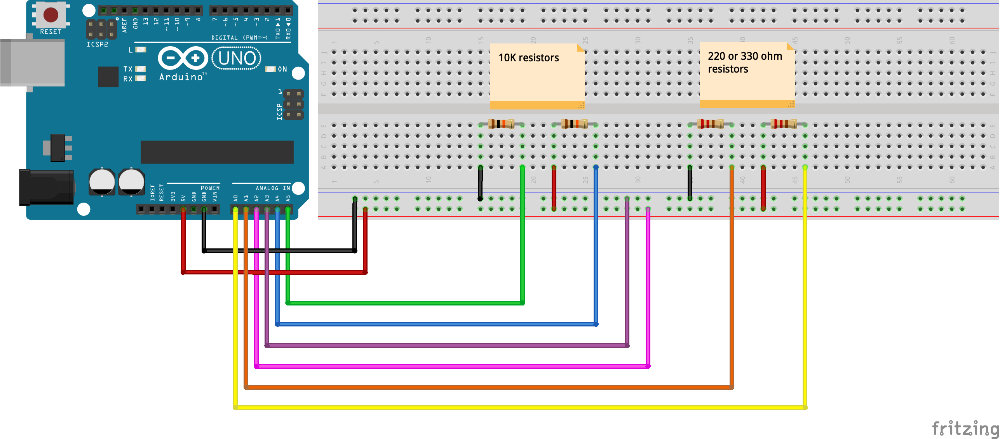
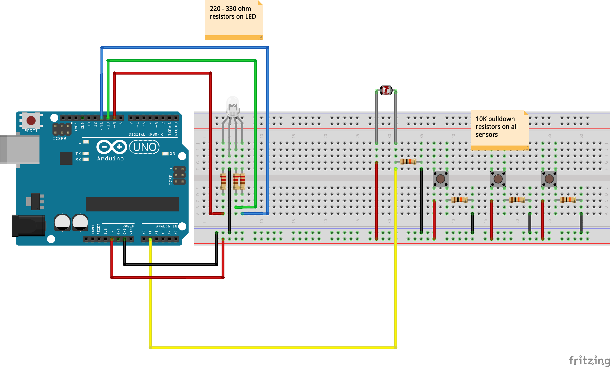

# Week 02 · Analog vs. Digital

Last week, we learned how to use a button and LED with *digital control*. We could see if a button was pressed or not, and turn an LED on and off. Digital controls are great for components where there are only two states – components that have *binary* inputs or outputs. 

But, far more intereseting and useful in design context are *analog* components which offer a range of input or output values. Most simple and inexpensive sensors are analog sensors, which are effectively resistors with *variable* resistance. Even cooler than analog components proper are pulse-width-modulated (PWM) components which use a *high frequency digital signal* to emulate an analog signal.

Be aware that the use of the terms *digital* and *analog* in this context refer specifically to a kind of data, and do not imply the [total nonsense](https://www.soundonsound.com/techniques/digital-myth) that infects the high-end audio world, which continues to make an argument that analog audio sounds better — or is a more accurate reproduction — than digital audio. Neither is better or worse, or has the capability for more or less accuracy — the two are simply different ways of encoding data. 

First, make sure you [download and install Fritzing](http://fritzing.org/download/), a great open source program for drawing pretty circuit diagrams.

- [Hydraulic Analogy for Electricity](https://learn.sparkfun.com/tutorials/voltage-current-resistance-and-ohms-law/current)
- [Components](#components): RGB LED, Photoresistor
- [Circuits](#circuits): Analog Voltage and Color Mixer
- [Code](#code): analogRead(), analogWrite(), map(), constrain()
- [Homework](#homework) : RGB Color Controller

-----

### Components

#### RGB LED (Common Cathode)


3 LEDs in one -- use this component to mix colors and produce your own colored light! RGB LEDs have three independently controllable subdiodes for red, green, and blue light. Common Cathode RGB LEDs, like the ones that come in our kits, combine *ground* for all three of the internal LEDs. Common Anode RGB LEDs, also available and more common in higher quality LEDs, combine *voltage in*.

Review [additive color mixing principles](https://en.wikipedia.org/wiki/Additive_color) to better understand why red + green does not make brown! 

#### Photoresistor (or Light-Dependent Resistor)


This small *analog* sensor relies on the flexion that occurs when a lead-based metal alloy (wash your hands after touching it!) is exposed to light and minutely adjusts its electrical resistance. The more light that strikes the [photoresistor](https://en.wikipedia.org/wiki/Photoresistor) and its characteristic wave-shaped *bandgap*, the more voltage can flow through the component. In the darkness, the component has a high resistance and prevents the flow of electrons from jumping the bandgap. Photoresistors are used in any object that need to reference the general intensity of light or shadow in a space, and are frequently used for day-night behavior switching.

In order to use a photoresistor, we use a [voltage divider circuit](https://learn.sparkfun.com/tutorials/voltage-dividers). In a voltage divider, the ratio between a *fixed resistor* (usually 10k) and a *variable resistor* is reflected in a measured output voltage.

----- 

### Circuits

Remember to try to wire with an encoding schema in mind...

- Red for 5V Power
- Orange for 3V3 Power
- Black, White, Gray, or Brown for Ground
- Yellow or Purple for Generic Signals
- Green and Blue for I2C Communication

Always choose wire colors for understandability, even if it means violating the above guidelines! 

#### Measuring Analog Voltage

Check your expectations, and review pullup and pulldown resistors.



#### Color Mixing Circuit

Use a set of digital and analog controls to manipulate an RGB LED!



-----

### Code

Double check that "Tools" -> "Board" is set to "Arduino/Genuino Uno" and that "Tools" -> "Port" is set to whichever "COM" USB port has a connected "Arduino Uno".

```c
void setup() {
  // put your setup code here, to run once:
  //set RGB LED pins as output
  pinMode(9, OUTPUT);
  pinMode(10, OUTPUT);
  pinMode(11, OUTPUT);
  
  //set Photoresistor pin to input
  pinMode(A1, INPUT);

  //begin USB communication
  Serial.begin(9600);
}

void loop() {
  // put your main code here, to run repeatedly:
  //store reading from Photoresistor in variable
  int lightReading = analogRead(A1);
  //convert values from calibrate domain to target range
  //the 500 and 900 below should be derived experimentally
  int mappedReading = map(lightReading, 500, 900, 0, 255);
  
  //make sure the values never float below 0 or above 255
  int constrainedReading = constrain(mappedReading, 0, 255);

  //print some feedback for visual debugging and calibration
  Serial.print("original Reading: ");
  Serial.print(lightReading);
  Serial.print(" - ");
  Serial.print("mapped Reading: ");
  Serial.print(mappedReading);
  Serial.print(" - ");
  Serial.print("Constrained Reading: ");
  Serial.println(constrainedReading);
  //note the 'println' on the last line so that a new line is created

  //use transformed values to drive LED colors.
  //this code will start red, and become more blue as light intensity increases
  analogWrite(11, constrainedReading);
  analogWrite(9, 255 - constrainedReading);
}
```
-----

### Homework

Add two more photoresistors to your circuit from class to drive each color channel (red, green, and blue) independently. Play with arithmetic, `map()` and `constrain()` so that the colors behave in interesting ways as brightness changes. Ensure that your code is well-calibrated to the lighting conditions of the studio.
