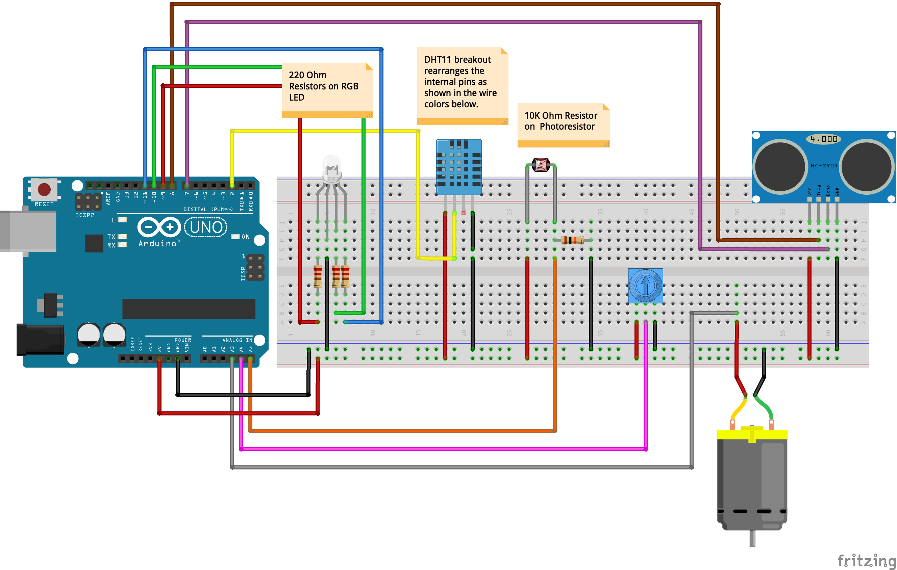
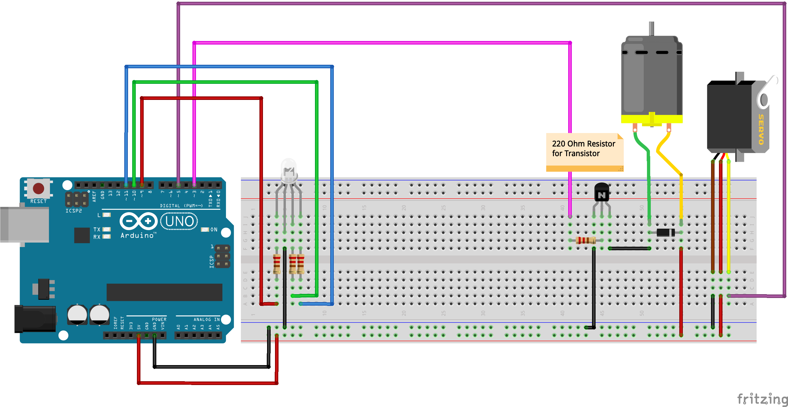

# Week 06 · Managing and Collecting Data 

Let's put everything we've learned into a deployable package, and talk about how to plan for and create data collection instruments.

- [Components](#components): DHT11, HC-SR04 Distance Sensor, Motors, Transistors, Diodes
- [Circuits](#circuits): Weather Station
- [Code](#code): pulseIn, compound conditionals, serial plotter, creating datasets
- [Homework](#homework) : Project Presentation

-----

### Components

#### HC-SR04


The HC-SR04 is a very cheap sensor that can accurately determine how far away the nearest object is to it. It is simple to use, and highly accurate when set up with a knowledge of its limitations and abilities. When a signal is sent to a certain *trigger* pin on the HC-SR04, an unaudible sonic *ping* is generated that propogates outwards in a conic shape with around 30 degrees of spread. Quickly switching the *trigger* pin off, and turning on the *echo* pin forces the sensor into listening mode, and it will wait until it hears its own voice bounce back. It alerts a microcontroller when it hears its voice, and the microcontroller can determine how much time passed. With knowledge of the speed of sound, acurate distances can then be calculated. 


The range of the sensor's voice and sensitivity of its ears allows it to measure distances from 2cm to 400cm in ideal conditions, though its real precision will be dependent on the accuracy of the driving microcontroller's clock and ambient environmental and sonic conditions. For maximum precision, the humidity and distance from sea-level of the sensor need to be taken into account, and there are many ways to [add even more precision](https://www.intorobotics.com/8-tutorials-to-solve-problems-and-improve-the-performance-of-hc-sr04/) by modulating how often the ping is emmitted to achieve better range. In ultrasonically noisy environments, a more expensive though more accurate [light-based time of flight (ToF) sensor](https://www.sparkfun.com/products/12785) is a much better choice.


The HC-SR04 sensor was developed [biomimetically](https://www.cnbc.com/2015/05/22/biomimetics-improving-sonar-by-borrowing-from-nature.html) — and effectively recreates the [echolocational](https://en.wikipedia.org/wiki/Animal_echolocation) spatial awareness systems of dolphins and other cetaceans, bats, tenrecs, and switfts. It also derived from the same *Sonar* sensor logic lineage implemented by [submarines](https://en.wikipedia.org/wiki/Sonar) and [sounding vessels](https://en.wikipedia.org/wiki/Echo_sounding) underwater — and a waterproofed version of the sensor is [similarly available](http://chinaultrasound.com/product/1mhz-ultrasonic-transducer-depth-measurement-td1000ka/). Humans even have a [weak form of native echolocation](https://en.wikipedia.org/wiki/Human_echolocation) based on our own voice, ears, and our cognitive understanding of the Doppler effect. This sense can be [further developed](https://www.sciencealert.com/humans-are-being-taught-to-echolocate-like-dolphins-and-it-s-surprisingly-easy) — and has been by several sighted and vision-impaired individuals — for improved sightless navigational awareness inside and outside of low-light conditions.


#### DC Motor


A DC motor converts electricity into a magnetic field, which in turn drives rotational movement. Inside the motor housing, a set of permanent magnets exert force on the 'armature', a carefully shaped piece of wire through which electrons flow. The magnets exert a force on the electrons as they pass through the cylinder of the motor, and torque is created according to Fleming's [Left Hand Rule](https://en.wikipedia.org/wiki/Fleming%27s_left-hand_rule_for_motors). DC motors are designed to spin fast, and not to exert much torque. For this reason, they often require [gearing up or down](https://en.wikipedia.org/wiki/Gear).

Motors are simple components, but they require a couple of safety measures [explained well here](http://www.sharetechnote.com/html/Arduino_MotorBasics.html). Rather than driving motors directly with a PWM pin, it is very important to use a transistor with a PWM pin as well as a diode to protect the Arduino.

Fancy motor driving chips, like the well-known [L293D](https://www.adafruit.com/product/807), can toggle the polarity of the signal and allow a DC motor to spin in both directions. With a transistor, though, only one direction of spin is possible.

Motors require electricity to spin, but they can also be spun to *produce electricity*. When used in this way, DC motors are instead called turbines, and are deployed all over the world as [hydroelecric and anemoelectric generators](https://en.wikipedia.org/wiki/Water_turbine). This allows for fun power storage and reclamation projects [like this one](https://www.wired.com/story/battery-built-from-concrete/).


#### NPN Transistor


Transistors sit at the heart of every general purpose computer, making up the processors of computers. Transistors are fundamentally switches — but rather than relying upon a human for actuation — an electric current is used to open a connection. Whatever is connected to the *collector* leg is released to the *emitter* leg when the *base leg* receives power above a certain threshold. Read that last sentence a few times, and it will make sense!


Transistors are often used to manipulate high voltage and amperage electrical components with low voltage controllers and drivers.


#### Diode


Diodes are simple components. They are wires, but they only allow the flow of electricity in one direction. In most cases, diodes are used as *flybacks*, which [protect components from high kickback voltage](https://en.wikipedia.org/wiki/Flyback_diode). Diodes always have a stripe or mark on them near their *cathode*. Electrons can only flow through diodes from anode to cathode, so commonly in circuits, it looks like they are connected backwards — since they are there for protection! [All LEDs are diodes](https://learn.sparkfun.com/tutorials/polarity/diode-and-led-polarity), it just so happens that they convert electons flowing through them into visual photos, rather than heat.


#### (Micro)Servo Motor


Servo motors are DC motors with a reducing [gear train](https://en.wikipedia.org/wiki/Gear_train) inside as well as a control board. Depending on the length of pulses received on a signal wire, the servo motor will turn to a specific degree. This motion takes time, and so it is important to add `delay()`s to your code to provide time for the movement to complete. Servos are essential for most robotics and controlled motion applications. Microservos, like the ones included in our kits, are normally limited to a bit less than 180 degrees of motion. 'Continous Rotation' servos allow for full 360 degree motion.


#### DHT11 Temperature and Relative Humidity Sensor


A semi-water permeable substrate layer next to a thermistor inside this sensor allows for a *relatively* accurate reading of both ambient temperature and humidity. Theoretically, the DHT11 is rated to a precision of plus or minus 2 degrees celsius and 5% humidity, though due to manufacturing realities, the sensor often requires calibration. Despite its analog sensing logic, this sensor communicates over a digital pin — and like most sensors, requires installing a library.

The sensor package itself has *4 legs*, from left to right: power, signal, no connection (NC), ground. It is often mounted on a breakout board, which rearranges those connections (signal, power, ground), integrates the required pullup resistor, and removes the useless *NC* leg. 


----- 

### Circuits

Remember to try to wire with an encoding schema in mind...

- Red for 5V Power
- Orange for 3V3 Power
- Black, White, Gray, or Brown for Ground
- Yellow or Purple for Generic Signals
- Green and Blue for I2C Communication

#### Weather Station

Here, let's combine a bunch of sensors into a single weather station object.

- DHT-11 to measure temperature and humidity
- DC Motor to measure wind speeds (modeling an [anemometer](https://www.adafruit.com/product/1733))
- Trimpot to measure wind direction (modeling a high precision [anemogoniometer](https://uk.rs-online.com/web/p/products/2943690/))
- Photoresistor to measure solar radiation (modeling a wide dynamic range [photometer](https://www.adafruit.com/product/1980))
- HC-SR04 to measure nearest object proximity, to determine if there is something obstructing accurate readings.



If we have time, let's also learn how to drive a set of motors, rather than just read from them.



-----

### Code

Double check that "Tools" -> "Board" is set to "Arduino/Genuino Uno" and that "Tools" -> "Port" is set to whichever "COM" USB port has a connected "Arduino Uno".

#### Distance Sensor

```c
// Listening 'Echo' Pin
int echoPin = 7;
// Blasting 'Trigger' Pin
int trigPin = 8 ;
// Red subdiode of RGB LED
int rPin = 9; 
// Green subdiode of RGB LED
int gPin = 10; 

//define bounds in cm
int maxRange = 200; 
int minRange = 10; 

//create needed variables at boot to save time later
long duration, distance; // Duration used to calculate distance

void setup() {
  //enable USB serial logging
  Serial.begin (9600);

  //necessary pin modes
  pinMode(trigPin, OUTPUT);
  pinMode(echoPin, INPUT);
  pinMode(rPin, OUTPUT); // Use LED indicator (if required)
}

void loop() {
  //set trigger low  to ensure we don't have any noise from previous cycle
  digitalWrite(trigPin, LOW); 
  //wait a very small amount of time to let electricity to clear the system
  delayMicroseconds(2); 

  //blast out sound!
  digitalWrite(trigPin, HIGH);
  //make sure electricity gets to sensor and emits enough sound
  delayMicroseconds(10); 

  //turn off blaster
  digitalWrite(trigPin, LOW);

  //turn listening on and wait
  duration = pulseIn(echoPin, HIGH);

  //calculate the distance (in cm) based on the speed of sound.
  //since the amount of time is a round trip, we need to first divide by 2
  //sound travels 343 meter/second in sea-level, room temp air
  //343 m/s = .0343 centimeter/microsecond
  // 1 microsecond / .0343 = 29.1 cm of sound travel / microsecond
  distance = ( duration / 2 ) / 29.1;

  //error catch
  if (distance >= maxRange || distance <= minRange){
    // if sensor reads out of range, send a clear signal that the reading isn't trustworthy
    Serial.println("-1");

    //signal bad reading
    digitalWrite(rPin, HIGH); 
    digitalWrite(gPin, LOW); 
  }

  else {
    //print reading over usb
    Serial.println(distance);
    //signal good reading
    digitalWrite(rPin, LOW); 
    digitalWrite(gPin, HIGH); 
  }

  //Delay 50ms before reading again
  delay(50);
}
```

Also, if time permits...


```c
int motorPin = 3;
 
void setup() 
{ 
  pinMode(motorPin, OUTPUT);
  Serial.begin(9600);
} 
 
 
void loop() 
{ 
  if (Serial.available())
  {
    int motorSpeed = Serial.parseInt();
    if (motorSpeed >= 0 && motorSpeed <= 255)
    {
      analogWrite(motorPin, motorSpeed);
    }
  }
} 

```

-----

### Homework

Prepare a short presentation for the project you would like to work on this semester! More details to come after class.

